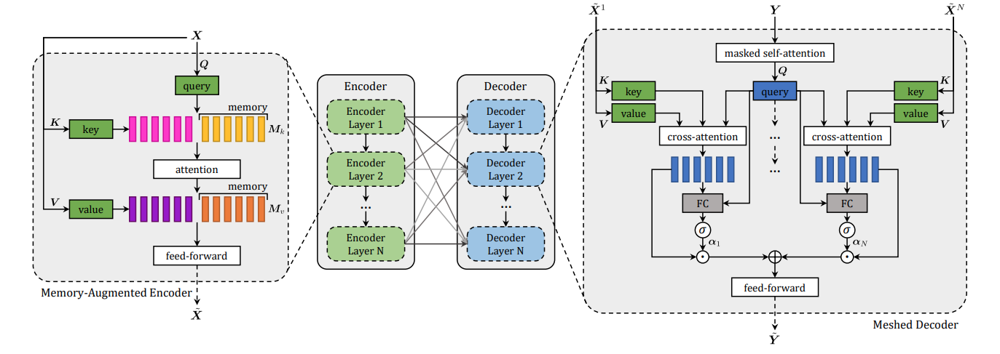

Meshed-Memory Transformer
===



This is the re-implemented version of [Meshed-Memory Transformer](https://arxiv.org/pdf/1912.08226.pdf) (M2 Transformer) to evaluate its performance on the [UIT-ViIC](https://arxiv.org/pdf/2002.00175.pdf) dataset and [VieCap4H](https://people.cs.umu.se/sonvx/files/VieCap4H_VLSP21.pdf) dataset.

For detailed implementation for this repository, please visit the repository [OpenViIC](https://github.com/hieunghia-pat/OpenViIC). To construct the M2 Transformer method, please change the configration in the `configuration.py` file in the repository [OpenViIC](https://github.com/hieunghia-pat/OpenViIC) as below:

```python
encoder_self_attention = AugmentedMemoryScaledDotProductAttention
encoder_self_attention_args = {"m": total_memory}
encoder_args = {}
decoder_self_attention = ScaledDotProductAttention
decoder_enc_attention = ScaledDotProductAttention
decoder_self_attention_args = {}
decoder_enc_attention_args = {}
decoder_args = {"N_enc": nlayers}
encoder = MultiLevelEncoder
decoder = MeshedDecoder
transformer_args = {}
```

## Contact
This project constructed under instruction of the NLP@UIT research group. For more information about the NLP@UIT group or relevant publications, please visit [http://nlp.uit.edu.vn/](http://nlp.uit.edu.vn/).

 - Nghia Hieu Nguyen: [19520178@gm.uit.edu.vn](mailto:19520178@gm.uit.edu.vn)
 - Duong T.D Vo: [19520483@gm.uit.edu.vn](mailto:19520483@gm.uit.edu.vn)
 - Minh-Quan Ha: [19522076@gm.uit.edu.vn](mailto:19522076@gm.uit.edu.vn)
